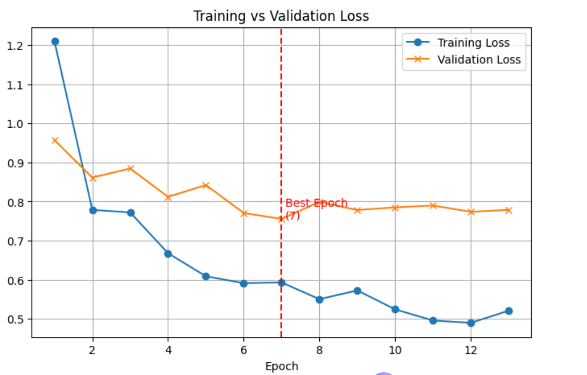
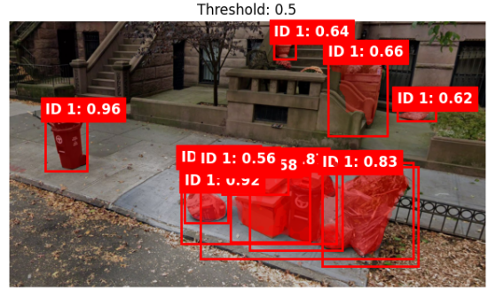
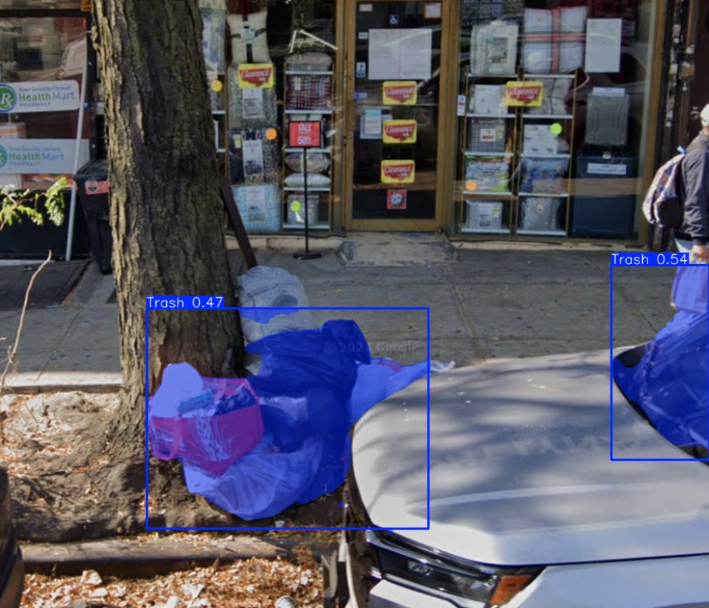

# 🗑️ Urban Litter Detection Using Mask R-CNN & YOLOv8

## 📌 Project Overview
This project is part of my **Data Science Capstone** and focuses on detecting trash in street-level images using **deep learning models**.  
The goal is to build a robust object detection pipeline and correlate **trash density** with **school violation datasets** (teacher safety and socio-economic factors).

We implemented and compared two state-of-the-art models:
- **Mask R-CNN** (segmentation + bounding box detection)
- **YOLOv8** (real-time object detection & segmentation)

---

## 📂 Dataset
- **143 custom street images** manually annotated for trash.
- **COCO-style dataset format** for compatibility with PyTorch/Detectron2.
- Dataset split: **80% training / 20% validation**.
- **Data augmentation applied**:
  - Random flips, rotations
  - Color jittering
  - Scaling and random cropping

---

## ⚙️ Methods
### Mask R-CNN
- Implemented using PyTorch & Detectron2.
- Custom COCO-style dataset loader.
- Generated both **bounding boxes** and **segmentation masks**.

### YOLOv8
- Implemented using Ultralytics YOLOv8.
- Experiments on both **detection** and **segmentation** tasks.
- Faster inference, lightweight, better mAP performance.

---

## 📊 Results

### Mask R-CNN (COCO Evaluation)
- **Bounding Box**  
  - mAP@0.5 = **0.089**  
  - Recall (AR@100) = **0.088**

- **Segmentation**  
  - mAP@0.5 = **0.101**  
  - Recall (AR@100) = **0.106**

### YOLOv8 (Ultralytics Evaluation)
- **Bounding Box**  
  - Precision = **0.654**  
  - Recall = **0.326**  
  - mAP@0.5 = **0.371**

- **Segmentation**  
  - Precision = **0.547**  
  - Recall = **0.395**  
  - mAP@0.5 = **0.402**

### Comparison Table

| Model                | mAP@0.5 | Precision | Recall | Notes |
|----------------------|---------|-----------|--------|-------|
| Mask R-CNN (BBox)    | 0.089   | 0.089*    | 0.088  | Better on large items, struggles with clutter. |
| Mask R-CNN (Segm)    | 0.101   | 0.101*    | 0.106  | Segmentation stronger than bbox, slower inference. |
| YOLOv8 (BBox)        | 0.371   | 0.654     | 0.326  | Higher precision, moderate recall, fast (~40 ms/img). |
| YOLOv8 (Segm)        | 0.402   | 0.547     | 0.395  | Best overall performance, balanced trade-off. |

\*For Mask R-CNN, AP@0.5 is used as precision proxy.

---

  

## 📈 Visualizations

### Training/Validation Loss for Masked R-CNN

### Inference Examples – Masked R-CNN

### Inference Examples – YOLOv8

